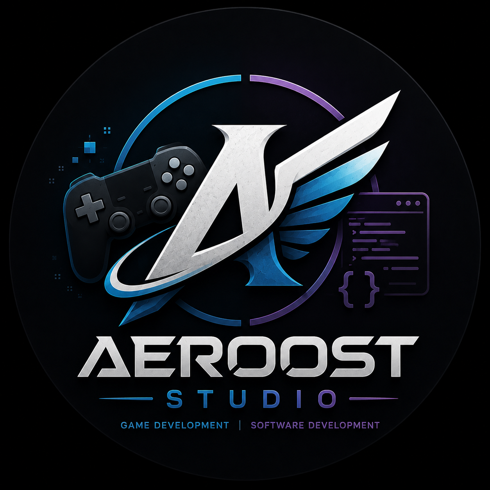

<html lang="fa" dir="rtl">
<head>
    <meta charset="UTF-8">
    <meta name="viewport" content="width=device-width, initial-scale=1.0">
    <meta name="description" content="AEROOST STUDIO | توسعه بازی و نرم‌افزار با هوش مصنوعی">
    <title>AEROOST STUDIO | استودیوی خلاق دیجیتال</title>
    <link href="https://fonts.googleapis.com/css2?family=Inter:opsz,wght@14..32,300;14..32,400;14..32,500;14..32,600;14..32,700;14..32,800&family=Vazirmatn:wght@300;400;500;600;700;800&display=swap" rel="stylesheet">
    <link rel="stylesheet" href="https://cdnjs.cloudflare.com/ajax/libs/font-awesome/6.0.0-beta3/css/all.min.css">
    
</head>
<body class="dark">
    <header class="header">
        

            

                
                

                    
AEROOST

                    
STUDIO

                

            

            

                <a href="#" class="nav-link active">خانه</a>
                <a href="#" class="nav-link">خدمات</a>
                <a href="#" class="nav-link">بازی‌ها و برنامه‌ها</a>
                <a href="#" class="nav-link">وبلاگ</a>
                <a href="#" class="nav-link">تماس</a>
                <a href="#" class="nav-link">درباره</a>
            

            <button class="theme-btn" id="themeToggle">
                <i class="fas fa-sun"></i>
                <i class="fas fa-moon"></i>
            </button>
        

    </header>

    <main>
        

            <!-- Hero -->
            <section class="hero">
                

                    

                        ✨ AI-POWERED STUDIO
                        <h1>AEROOST STUDIO</h1>
                        

                            توسعه بازی · نرم‌افزار سفارشی · اپلیکیشن موبایل · هوش مصنوعی
                        

                        

                            <a href="#" class="btn-primary"><i class="fas fa-arrow-left"></i> مشاهده محصولات</a>
                            <a href="#" class="btn-outline"><i class="fas fa-cog"></i> مشاهده خدمات</a>
                        

                        

                            
<h4>۲+</h4>
سال تجربه

                            
<h4>۱۰+</h4>
پروژه انجام شده

                        

                    

                    

                        <i class="fas fa-microchip"></i>
                    

                

            </section>

            <!-- خدمات من -->
            <section class="section">
                <h2 class="section-title fade-up">خدمات من</h2>
                

                    

<i class="fas fa-gamepad"></i>
<h3>توسعه بازی حرفه‌ای</h3>
طراحی و ساخت بازی‌های موبایل و کامپیوتر با گرافیک بالا، گیم‌پلی روان و بهینه‌سازی شده برای تمام پلتفرم‌ها

                    

<i class="fas fa-laptop-code"></i>
<h3>نرم‌افزار سفارشی</h3>
توسعه پنل‌های مدیریت حرفه‌ای، داشبوردهای تحلیلی و سیستم‌های تحت وب با معماری مدرن و امنیت بالا

                    

<i class="fas fa-brain"></i>
<h3>هوش مصنوعی و چت‌بات</h3>
ساخت چت‌بات‌های هوشمند، سیستم‌های پیشنهاددهنده و یکپارچه‌سازی مدل‌های زبانی پیشرفته در پروژه‌ها

                    

<i class="fas fa-music"></i>
<h3>اپلیکیشن پخش آهنگ</h3>
طراحی پلیرهای حرفه‌ای موسیقی با امکانات پیشرفته مانند پخش آفلاین، لیست‌های هوشمند و یکپارچه‌سازی با سرویس‌های مختلف

                    

<i class="fas fa-video"></i>
<h3>ویرایشگر ویدیو</h3>
توسعه ابزارهای ویرایش ویدیو با قابلیت‌های برش، ادغام، افزودن افکت، زیرنویس و خروجی با کیفیت بالا

                    

<i class="fas fa-image"></i>
<h3>ویرایشگر عکس</h3>
ساخت اپلیکیشن‌های ویرایش عکس حرفه‌ای با فیلترهای متنوع، ابزارهای تنظیم رنگ، افکت‌های ویژه و پردازش هوشمند

                

            </section>

            <!-- پروژه‌ها -->
            <section class="section">
                <h2 class="section-title fade-up">پروژه‌های من</h2>
                

                    
<i class="fas fa-th" style="font-size:2rem; color:var(--cyan); margin-bottom:1rem;"></i><h3>بازی ۲۰۴۸ حرفه‌ای</h3>
بازی معمایی و فکری با گرافیک مدرن، انیمیشن‌های روان و گیم‌پلی اعتیادآور
✓ تکمیل شده

                    
<i class="fas fa-comment-dots" style="font-size:2rem; color:var(--cyan); margin-bottom:1rem;"></i><h3>چت‌بات هوش مصنوعی</h3>
سیستم پاسخگوی هوشمند با قابلیت پردازش زبان طبیعی و یادگیری از تعاملات
✓ تکمیل شده

                    
<i class="fas fa-tachometer-alt" style="font-size:2rem; color:var(--cyan); margin-bottom:1rem;"></i><h3>سایت پنل مدیریت</h3>
داشبورد مدیریت کامل با نمودارهای تعاملی و گزارش‌گیری پیشرفته
✓ تکمیل شده

                    
<i class="fas fa-music" style="font-size:2rem; color:var(--cyan); margin-bottom:1rem;"></i><h3>برنامه پخش آهنگ</h3>
پلیر حرفه‌ای موسیقی با امکانات پیشرفته و رابط کاربری زیبا
✓ تکمیل شده

                    
<i class="fas fa-video" style="font-size:2rem; color:var(--cyan); margin-bottom:1rem;"></i><h3>ویرایشگر ویدیو</h3>
ابزار ویرایش ویدیو با قابلیت‌های حرفه‌ای و خروجی با کیفیت بالا
✓ تکمیل شده

                    
<i class="fas fa-image" style="font-size:2rem; color:var(--cyan); margin-bottom:1rem;"></i><h3>ویرایشگر عکس</h3>
اپلیکیشن ویرایش عکس با فیلترهای متنوع و ابزارهای حرفه‌ای
✓ تکمیل شده

                    
<i class="fas fa-puzzle-piece" style="font-size:2rem; color:var(--purple); margin-bottom:1rem;"></i><h3>بازی کلمه‌یار</h3>
بازی فکری حدس کلمه با هوش مصنوعی، سطوح مختلف و بیش از ۳۰۰۰ کلمه
⚡ در حال ساخت

                

            </section>

            <!-- تکنولوژی‌های من -->
            <section class="section">
                <h2 class="section-title fade-up">تکنولوژی‌های من</h2>
                

                    
<i class="fab fa-unity"></i><h3>Unity</h3>
توسعه بازی‌های دوبعدی و سه‌بعدی حرفه‌ای

                    
<i class="fab fa-python"></i><h3>Python</h3>
هوش مصنوعی، یادگیری ماشین و بک‌اند

                    
<i class="fab fa-js"></i><h3>JavaScript</h3>
توسعه وب پویا و تعاملی

                    
<i class="fab fa-react"></i><h3>React</h3>
ساخت رابط‌های کاربری مدرن و سریع

                    
<i class="fas fa-mobile-alt"></i><h3>Flutter</h3>
توسعه اپلیکیشن‌های چندسکویی

                    
<i class="fas fa-robot"></i><h3>OpenAI API</h3>
یکپارچه‌سازی هوش مصنوعی پیشرفته

                    
<i class="fas fa-database"></i><h3>AI & ML</h3>
مدل‌های زبانی و یادگیری ماشین

                    
<i class="fas fa-code"></i><h3>C# / C++</h3>
برنامه‌نویسی سطح بالا و بهینه

                

            </section>

            <!-- چطور کار می‌کنم؟ -->
            <section class="section">
                <h2 class="section-title fade-up">چطور با هم کار می‌کنیم؟</h2>
                

                    

۱
<h3>گفتگو و ایده‌پردازی</h3>
در این مرحله، ایده شما را با دقت گوش می‌دهم، نیازها را تحلیل می‌کنم و بهترین مسیر برای اجرای پروژه را مشخص می‌کنیم. این مرحله کاملاً رایگان است.

                    

۲
<h3>طراحی و برنامه‌ریزی</h3>
ساختار پروژه طراحی می‌شود، معماری فنی مشخص می‌گردد و یک نقشه راه دقیق برای توسعه تهیه می‌شود تا همه چیز شفاف باشد.

                    

۳
<h3>توسعه با هوش مصنوعی</h3>
با استفاده از قدرتمندترین ابزارهای هوش مصنوعی، کدنویسی انجام می‌شود که باعث افزایش سرعت، کاهش خطا و کیفیت بسیار بالاتر می‌گردد.

                    

۴
<h3>آزمایش و تحویل</h3>
پروژه به طور کامل تست می‌شود، باگ‌ها رفع می‌گردند و در نهایت تحویل داده می‌شود. پشتیبانی ۳ ماهه نیز ارائه می‌شود.

                

            </section>

            <!-- وبلاگ -->
            <section class="section">
                <h2 class="section-title fade-up">آخرین مطالب وبلاگ</h2>
                

                    

                        <i class="fas fa-newspaper" style="font-size:2rem; color:var(--cyan); margin-bottom:1rem;"></i>
                        <h3>بهترین ابزارهای هوش مصنوعی برای توسعه بازی</h3>
                        
معرفی قدرتمندترین ابزارهای AI که فرآیند توسعه بازی را متحول می‌کنند...

                        
<i class="far fa-calendar"></i> ۱۵ خرداد ۱۴۰۴<i class="far fa-clock"></i> ۵ دقیقه مطالعه

                        <a href="#" class="read-more">ادامه مطلب ←</a>
                    

                    

                        <i class="fas fa-code" style="font-size:2rem; color:var(--cyan); margin-bottom:1rem;"></i>
                        <h3>چگونه با AI یک چت‌بات حرفه‌ای بسازیم؟</h3>
                        
آموزش گام به گام ساخت چت‌بات هوشمند با استفاده از OpenAI API و Python...

                        
<i class="far fa-calendar"></i> ۸ خرداد ۱۴۰۴<i class="far fa-clock"></i> ۸ دقیقه مطالعه

                        <a href="#" class="read-more">ادامه مطلب ←</a>
                    

                    

                        <i class="fas fa-gamepad" style="font-size:2rem; color:var(--cyan); margin-bottom:1rem;"></i>
                        <h3>معرفی موتورهای بازیسازی: Unity در مقابل Unreal</h3>
                        
مقایسه دو موتور قدرتمند بازیسازی و راهنمای انتخاب برای پروژه شما...

                        
<i class="far fa-calendar"></i> ۱ خرداد ۱۴۰۴<i class="far fa-clock"></i> ۶ دقیقه مطالعه

                        <a href="#" class="read-more">ادامه مطلب ←</a>
                    

                

                

                    <a href="#" class="btn-outline"><i class="fas fa-arrow-left"></i> مشاهده همه مقالات</a>
                

            </section>

            <!-- محصولات -->
            <section class="section">
                

                    

                        🔥 جدیدترین ساخته‌های من
                        <h3 style="font-size:1.4rem;">بازی‌ها و برنامه‌های AEROOST</h3>
                        
بازی‌های فکری، اپلیکیشن‌های کاربردی و ابزارهای هوشمند

                        

                            🎮 ۲۰۴۸
                            🎲 کلمه‌یار
                            📊 پنل مدیریت
                            🤖 چت‌بات
                            🎵 پخش آهنگ
                            🎬 ویرایشگر
                        

                    

                    <i class="fas fa-cubes" style="font-size:3rem; background:var(--gradient); -webkit-background-clip:text; background-clip:text; color:transparent;"></i>
                

            </section>

            <!-- سوالات متداول -->
            <section class="section">
                <h2 class="section-title fade-up">سوالات متداول</h2>
                

                    

⏱️ زمان ساخت پروژه چقدر است؟<i class="fas fa-chevron-down"></i>

زمان بستگی به پیچیدگی پروژه دارد، اما معمولاً بین ۲ ماه تا ۸ ماه. با کمک AI فرآیند توسعه بسیار سریع‌تر از روش‌های سنتی است.

                    

💰 هزینه خدمات چقدر است؟<i class="fas fa-chevron-down"></i>

هزینه بر اساس نوع، پیچیدگی و زمان تقریبی پروژه تعیین می‌شود. برای دریافت قیمت دقیق، از طریق تلگرام با من در ارتباط باشید.

                    

🔧 آیا پشتیبانی بعد از تحویل دارید؟<i class="fas fa-chevron-down"></i>

بله، پس از تحویل پروژه، پشتیبانی فنی و رفع باگ‌های احتمالی به مدت ۳ ماه کاملاً رایگان ارائه می‌شود.

                    

💻 از چه فناوری‌هایی استفاده می‌کنید؟<i class="fas fa-chevron-down"></i>

Unity برای بازی، Python و OpenAI API برای هوش مصنوعی، Flutter برای اپلیکیشن موبایل، React برای وب و C#/C++ برای برنامه‌نویسی سطح بالا.

                    

📱 چه نوع پروژه‌هایی انجام می‌دهید؟<i class="fas fa-chevron-down"></i>

بازی‌های موبایل و کامپیوتر، اپلیکیشن‌های کاربردی، نرم‌افزارهای مدیریتی، چت‌بات‌های هوشمند، ویرایشگرهای ویدیو و عکس، و هر پروژه خلاقانه دیگر.

                    

🤝 چگونه می‌توانم با شما همکاری کنم؟<i class="fas fa-chevron-down"></i>

کافی است از طریق تلگرام با من در ارتباط باشید. ایده خود را بگویید، مشاوره اولیه رایگان است و سپس برنامه همکاری را مشخص می‌کنیم.

                

            </section>

            <!-- CTA -->
            

                <h3>آماده شروع پروژه خود هستید؟</h3>
                
با هوش مصنوعی، پروژه‌ات را سریع‌تر و حرفه‌ای‌تر از همیشه بساز

                
مشاوره اولیه کاملاً رایگان

                <a href="#" class="btn-white"><i class="fab fa-telegram"></i> شروع همکاری در تلگرام <i class="fas fa-arrow-left"></i></a>
            

        

        <!-- فوتر -->
        <footer>
            

                <a href="#">خانه</a>
                <a href="#">خدمات</a>
                <a href="#">بازی‌ها و برنامه‌ها</a>
                <a href="#">وبلاگ</a>
                <a href="#">تماس</a>
                <a href="#">درباره</a>
            

            
            

                <a href="https://t.me/Aeroost_Studio" target="_blank"><i class="fab fa-telegram"></i> کانال تلگرام</a>
                <a href="https://t.me/Aeroost_Studio_admin" target="_blank"><i class="fab fa-telegram-plane"></i> ادمین</a>
            

            
            

                © ۲۰۲۶ AEROOST STUDIO
            

        </footer>
    </main>

    
</body>
</html>
